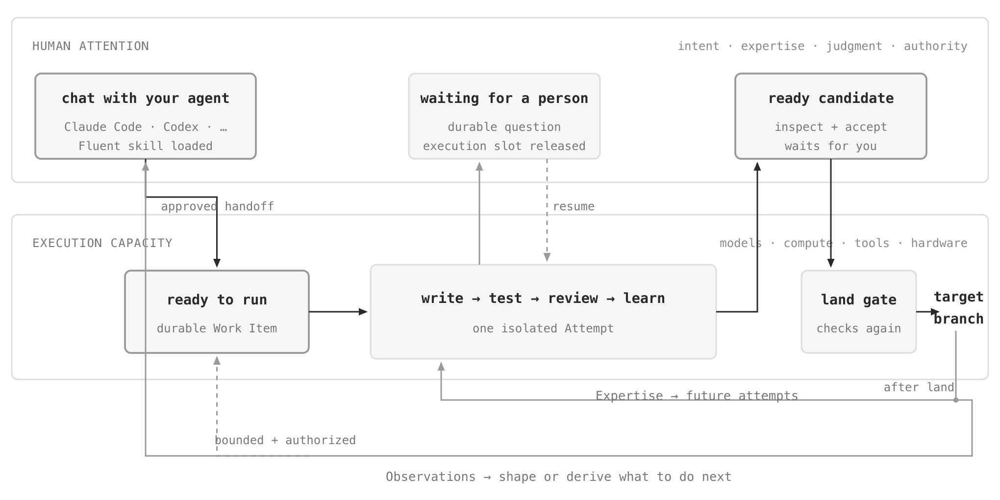
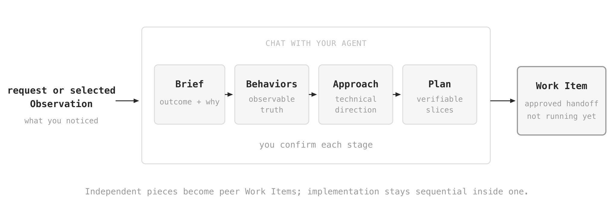
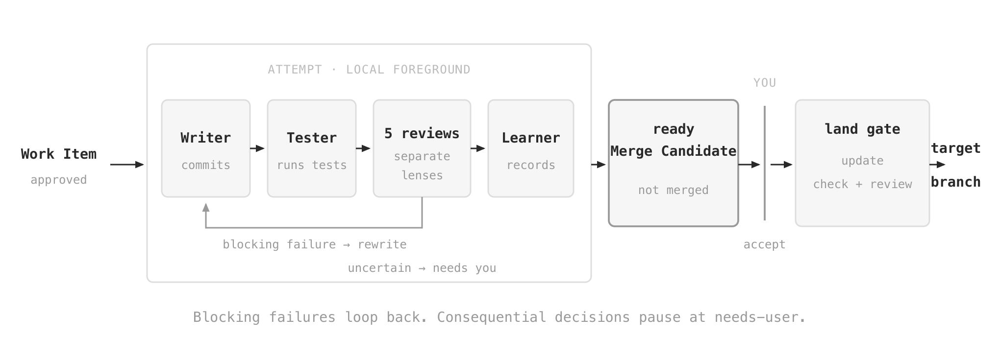
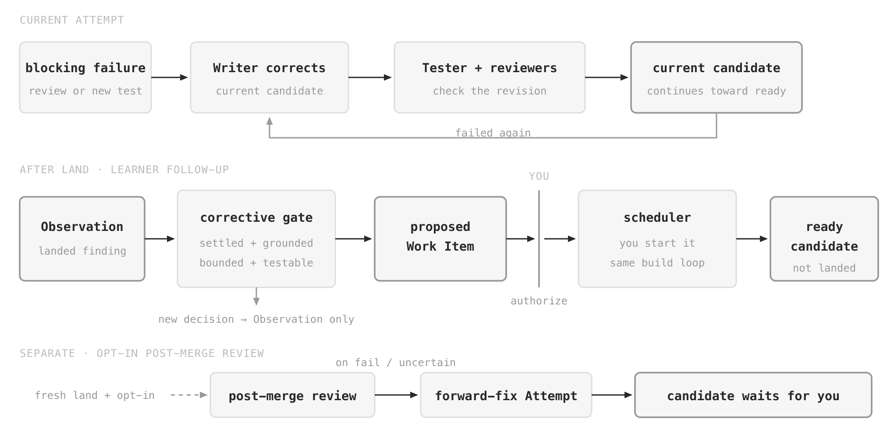
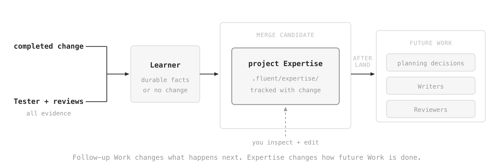

# fluent

Fluent is an autonomous, self-improving software factory delivered as an Agent Skill.

You use Fluent by chatting with Claude Code, Codex, or another coding agent that can load Agent Skills. Your agent conversation is the primary interface; you do not need to switch to a separate Fluent app to shape or run Work.

<p align="center">
  <picture>
    <source media="(prefers-color-scheme: dark)" srcset=".github/assets/fluent-overall-flow-dark.png">
    <source media="(prefers-color-scheme: light)" srcset=".github/assets/fluent-overall-flow-light.png">
    
  </picture>
</p>

The Agent Skill shapes the conversation and drives the local `fluent` CLI underneath it. The CLI keeps durable state, manages isolated worktrees, schedules execution, and records evidence. You rarely need to invoke it yourself.

People supply intent, judgment, domain knowledge, and authority to land changes. Execution environments supply model access, compute, tools, and hardware. Fluent keeps work that can run separate from work that needs a person: execution-ready Work Items wait for execution capacity, while questions and ready candidates wait for human attention. A scheduled Attempt that pauses for a person releases its execution slot, so other Work can continue.

## How you tell Fluent what to build

In the same agent conversation, start with a feature, a bug, or an Observation you recorded earlier. You do not need to arrive with a complete specification. The Fluent skill reads the relevant parts of the project, asks about decisions it cannot safely infer, and works through four questions with you:

| Artifact | What it settles |
|---|---|
| Brief | What outcome do you want, why, and what context matters? |
| Behaviors | What must be observably true when the work is done? |
| Approach | What technical direction will deliver those behaviors, and what does that choice give up? |
| Plan | What verifiable slices should the Writer reach, and which pieces can be built independently? |

You confirm each answer before moving on. Unknowns stay explicit; if a later stage exposes a missing behavior or design decision, the conversation returns to that stage instead of guessing.

<p align="center">
  <picture>
    <source media="(prefers-color-scheme: dark)" srcset=".github/assets/how-you-tell-fluent-dark.png">
    <source media="(prefers-color-scheme: light)" srcset=".github/assets/how-you-tell-fluent-light.png">
    
  </picture>
</p>

After you confirm the Plan, Fluent creates one or more Work Items containing the approved context. A Work Item is the durable handoff from planning to execution: creating it does not start a coder or schedule work. Independent pieces can become peer Work Items; implementation stays sequential inside one.

For example, “add machine-readable JSON output to our CLI's status command” can become a Brief explaining why CI needs it, a Behavior saying exactly what `status --json` emits, an Approach that reuses the existing status model, and a Plan that proves one end-to-end slice before covering compatibility and documentation.

## How Fluent builds it

When you ask Fluent to run a Work Item, it starts an Attempt in an isolated worktree. In the Local Preview, the Attempt runs locally in the foreground, where you can watch each round.

The Writer implements the approved Plan and commits a candidate. The Tester runs the project's configured test commands. Five reviewers then inspect the same commit through separate tasks for behaviors, architecture, tests, documentation, and skills. Review tasks run in parallel up to the configured concurrency limit.

<p align="center">
  <picture>
    <source media="(prefers-color-scheme: dark)" srcset=".github/assets/how-fluent-builds-dark.png">
    <source media="(prefers-color-scheme: light)" srcset=".github/assets/how-fluent-builds-light.png">
    
  </picture>
</p>

A new test failure or failing review verdict returns to the Writer, then Fluent tests and reviews the revision. An uncertain verdict or a decision outside the approved Behaviors and Approach pauses the Attempt at `needs-user` with the evidence collected so far instead of choosing for you. The current Local Preview can resume some infrastructure pauses in place; uncertain and exhausted-round pauses still require manual recovery.

Once the reviews pass, the Learner records reusable project knowledge and possible follow-ups. Only a successful Learner makes the Merge Candidate ready.

Ready does not mean merged. You inspect and accept the candidate first. The land gate then updates it against the current target branch, runs the configured checks and five review lenses again, and fast-forwards that branch only if they pass. If it cannot clear a conflict or finding within its bounds, it stops without moving the branch.

For the JSON status example, the Writer adds the response type and tests, the Tester runs the suite, and each reviewer checks one concern without editing the candidate it is reviewing.

## How Fluent keeps improving your code

Some findings improve the candidate being built. Others become the next piece of Work. During an Attempt, a new test failure or failing review verdict stays with the current Work Item: the Writer addresses it, then Fluent reruns the Tester and the affected reviewers.

The Learner can also record a separate change to make later, but it does not change the Observation backlog before the original candidate lands. After land, Fluent turns each follow-up into an Observation.

An Observation becomes corrective Work only when the change is bounded, testable, grounded in an existing Behavior, project instruction, or project Expertise, and requires no unresolved decision. Otherwise it stays an Observation for you to shape through the normal conversation.

<p align="center">
  <picture>
    <source media="(prefers-color-scheme: dark)" srcset=".github/assets/how-fluent-improves-dark.png">
    <source media="(prefers-color-scheme: light)" srcset=".github/assets/how-fluent-improves-light.png">
    
  </picture>
</p>

In the default `propose` mode, the skill shows you the corrective Work and waits. If you authorize it and ask Fluent to run queued Work, the same build loop starts. Authorization does not run or land anything by itself, and the scheduler stops at another ready Merge Candidate for you to inspect and land.

A project can choose `execute` mode to authorize and queue trusted corrective Work automatically within its follow-up limits. The scheduler still runs only when you start it, and every candidate still needs your acceptance before land. The Fluent skill offers this choice before it initializes a new project.

You can also ask Fluent to add a post-merge review when you land a candidate. On a clean fresh land, this separate opt-in schedules a detached Tester and reviewer pass against the landed change. A failing or uncertain review creates and runs a forward-fix Attempt. The Attempt can produce another candidate, but it cannot land it.

In the running example, Fluent might notice that another CI script still parses the human-readable status output. If the project already says machine callers must use versioned JSON, Fluent can propose a bounded correction. Without that rule, it records the finding as an Observation instead.

## How Fluent learns your project

Fluent's learning is project-local, versioned memory. It does not train the underlying model.

After an Attempt produces code and passes review, the Learner sees the complete change and every Tester and reviewer artifact. It can add reusable conventions, constraints, testing patterns, and gotchas to `.fluent/expertise/`, or leave Expertise unchanged when the work taught it nothing durable. It cannot change project source, documentation, or the Observation backlog.

<p align="center">
  <picture>
    <source media="(prefers-color-scheme: dark)" srcset=".github/assets/how-fluent-learns-dark.png">
    <source media="(prefers-color-scheme: light)" srcset=".github/assets/how-fluent-learns-light.png">
    
  </picture>
</p>

Expertise changes are part of the Merge Candidate, so they land with the code that taught them. A Learner failure keeps the candidate from becoming ready. Future planning checks recorded project decisions; Writers and Reviewers load the relevant Expertise. You can edit it directly when it is stale or wrong.

For the JSON status change, Fluent might retain the rule that machine-readable CLI output uses a versioned schema, serializes the existing status model, and does not change the text output. A later Writer starts with that rule, and later Reviewers check it.

Follow-up Work changes what Fluent does next. Expertise changes how Fluent does future work.

## Install

```sh
npx skills add mrinalwadhwa/fluent --skill fluent
```

This installs the bootstrap Agent Skill. Open your coding agent in a Git repository and ask it to use Fluent:

> Use Fluent to add machine-readable JSON output to the status command.

On first use, the skill installs the version-matched local CLI if it is missing, asks whether corrective follow-up Work should wait for your authorization or enter the execution queue automatically, initializes the project, and starts shaping the Work with you.

Fluent creates its work in sibling git worktrees next to your repo, so your working tree stays clean while it builds. Place your repo at `<project>/main/` so worktrees land as `<project>/work-*` siblings grouped under the project directory. Initialization prints a reminder if the directory is not named `main`.

Fluent currently runs on macOS, on both Apple Silicon and Intel.
